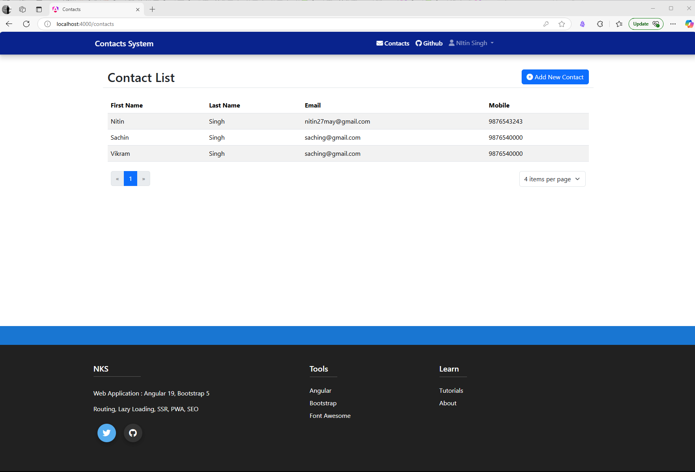
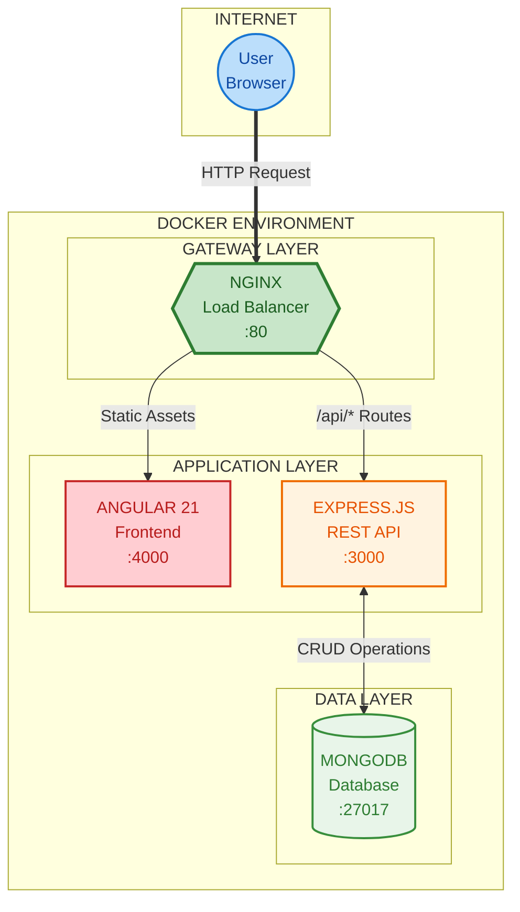
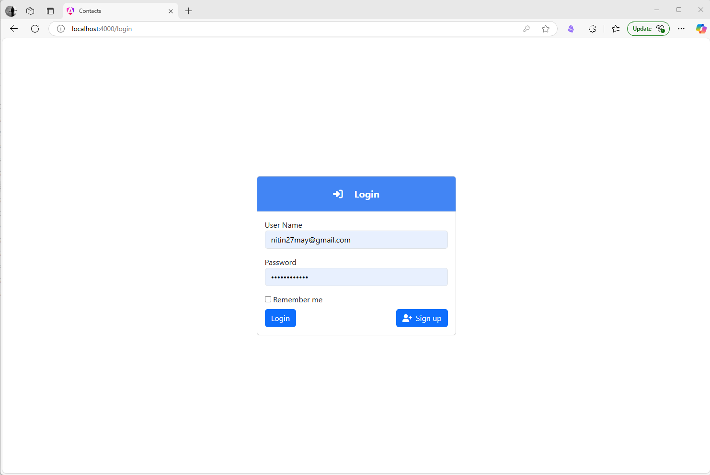

<div align="center">

# MEAN Stack with Docker

### Production-Ready Full-Stack Application

**MongoDB** | **Express.js** | **Angular 21** | **Node.js** | **Docker**

[](https://github.com/mean-docker/mean-docker/actions)
[](https://github.com/mean-docker/mean-docker/actions)
[](https://github.com/mean-docker/mean-docker/actions)

<br/>



<br/>

**A modern, containerized contact management system demonstrating best practices in full-stack TypeScript development**

[Get Started](#getting-started) | [View Demo](http://localhost) | [Documentation](#documentation) | [Report Bug](https://github.com/mean-docker/mean-docker/issues/new?template=bug_report.md)

</div>

---

## Table of Contents

- [Overview](#overview)
- [Architecture](#architecture)
- [Tech Stack](#tech-stack)
- [Getting Started](#getting-started)
- [Deployment Modes](#deployment-modes)
- [Features](#features)
- [Documentation](#documentation)
- [Roadmap](#roadmap)
- [Contributing](#contributing)
- [License](#license)

---

## Overview

This project demonstrates a production-ready MEAN stack application with modern development practices including TypeScript across the entire stack, JWT authentication, and Docker containerization. It serves as both a learning resource and a foundation for building scalable web applications.

### Key Highlights

| Feature | Technology |
|---------|------------|
| Frontend | Angular 21 with TypeScript and Bootstrap 5 |
| Backend | Express.js with TypeScript |
| Database | MongoDB with Mongoose ODM |
| Authentication | JWT-based secure authentication |
| Containerization | Docker and Docker Compose |
| Load Balancer | Nginx reverse proxy |
| CI/CD | GitHub Actions |

---

## Architecture

<div align="center">



</div>

### How It Works

| Layer | Component | Responsibility |
|:-----:|-----------|----------------|
| **Gateway** | Nginx | Single entry point on port 80. Routes traffic and serves as reverse proxy |
| **Frontend** | Angular 21 | Serves the user interface with reactive components and Bootstrap 5 styling |
| **Backend** | Express.js | Handles API requests, authentication, and business logic |
| **Data** | MongoDB | Persists user accounts and contact information |

### Request Routing

| Request Path | Routed To | Description |
|:-------------|:----------|:------------|
| `/*` | Angular :4000 | Static frontend assets and SPA routes |
| `/api/*` | Express :3000 | REST API endpoints |
| Database | MongoDB :27017 | Data persistence (internal only) |

---

## Tech Stack

<table>
<tr>
<td width="25%" valign="top">

### Frontend
- Angular 21
- TypeScript
- Bootstrap 5
- RxJS
- Router Guards

</td>
<td width="25%" valign="top">

### Backend
- Node.js
- Express.js
- TypeScript
- Mongoose ODM
- JWT Auth

</td>
<td width="25%" valign="top">

### Database
- MongoDB 7.0
- Mongoose
- Data Seeding

</td>
<td width="25%" valign="top">

### DevOps
- Docker
- Docker Compose
- Nginx
- GitHub Actions

</td>
</tr>
</table>

---

## Getting Started

### Prerequisites

- [Docker](https://www.docker.com/get-started/) and Docker Compose
- [Git](https://git-scm.com/downloads)

### Quick Start

```bash
# 1. Clone the repository
git clone https://github.com/mean-docker/mean-docker.git
cd mean-docker

# 2. Create environment file
cp .env.example .env

# 3. Start the application
docker-compose -f docker-compose.nginx.yml up
```

> **Ready in under 2 minutes!** Open [http://localhost](http://localhost) in your browser.

### Default Login

```
Username: admin@example.com
Password: P@ssword#321
```

---

## Deployment Modes

<table>
<tr>
<td width="50%">

### Development Mode

3 containers running on separate ports.

```bash
docker-compose up
```

| Service | URL |
|---------|-----|
| Frontend | http://localhost:4000 |
| API | http://localhost:3000 |
| Database | localhost:27017 |

</td>
<td width="50%">

### Production Mode

4 containers with Nginx gateway.

```bash
docker-compose -f docker-compose.nginx.yml up
```

| Service | URL |
|---------|-----|
| Application | http://localhost |
| Database | localhost:27017 |

</td>
</tr>
</table>

---

## Features

<table>
<tr>
<td width="50%">

### Authentication

- JWT-based secure login and registration
- Protected routes with Angular guards
- Token-based API authorization
- Password change functionality

</td>
<td width="50%">

### Contact Management

- Create, read, update, and delete contacts
- Responsive design for mobile and desktop
- Form validation with custom error messages
- Search, sort, and paginate contacts

</td>
</tr>
</table>

<p align="center">
  
</p>

---

## Documentation

| Document | Description |
|:---------|:------------|
| [Frontend](frontend/README.md) | Angular application architecture and components |
| [Backend API](api/README.md) | Express.js endpoints and middleware |
| [Database](docs/mongo-readme.md) | MongoDB schemas and data models |
| [Load Balancer](loadbalancer/README.md) | Nginx routing configuration |
| [Local Development](docs/local-devlopment.md) | Running without Docker |
| [Docker Guide](docs/docker-guide.md) | Container setup and configuration |

---

## Roadmap 2026

| Quarter | Focus Area | Goals |
|:-------:|:-----------|:------|
| Q1 | Testing & Quality | Unit tests, E2E tests with Cypress, code coverage reporting |
| Q2 | UI Modernization | Angular Material integration, dark/light theme, responsive redesign |
| Q3 | Security & Access | Role-based access control (Admin, Manager, User), OAuth 2.0 support |
| Q4 | Performance & Scale | Redis caching, API rate limiting, Kubernetes deployment configs |

See the [complete roadmap](docs/roadmap.md) for details.

---

## Contributing

Contributions are welcome. Please review our [Contributing Guide](CONTRIBUTING.md) before submitting changes.

- [Report a Bug](https://github.com/mean-docker/mean-docker/issues/new?template=bug_report.md)
- [Request a Feature](https://github.com/mean-docker/mean-docker/issues/new?template=feature_request.md)

---

## License

This project is licensed under the MIT License. See the [LICENSE](LICENSE) file for details.

---

<div align="center">

**Built by the MEAN Stack Community**

If you find this project useful, please consider giving it a star!

</div>
